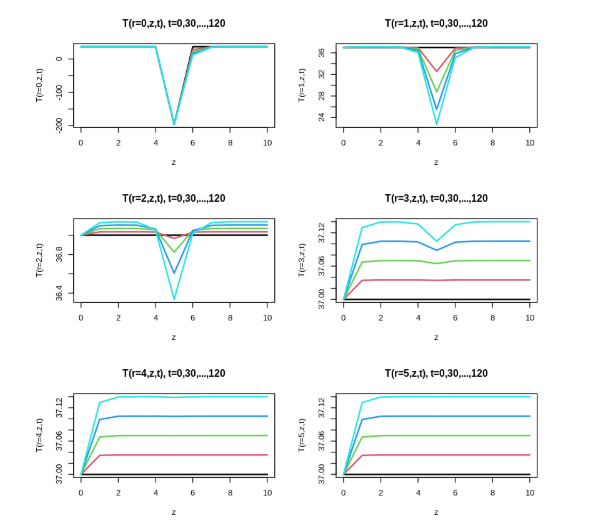
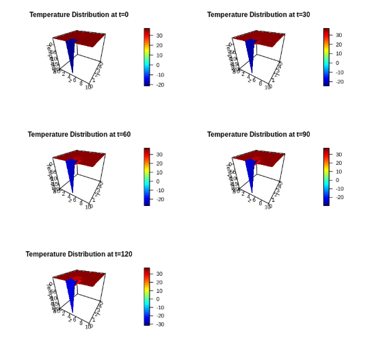

# Temperature-Distributions-in-Cryosurgery
# Numerical Simulation Using the Method of Lines (MOL)

This repository provides a numerical simulation of heat conduction in cylindrical coordinates using the Method of Lines (MOL).

You can run and explore the simulation directly in your browser using Google Colab

📊 Simulation Results

